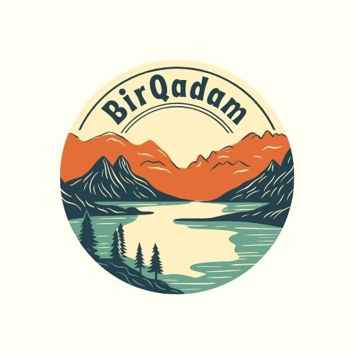

# BirQadam - Приложение для волонтеров 🌱

<div align="center">
  
  
  **Мобильное приложение для координации волонтерской деятельности в Алматы**
  
  [](https://flutter.dev)
  [](https://dart.dev)
  [](LICENSE)
</div>

---

## 📖 О проекте

**BirQadam** (ранее CleanUpAlmaty) - это комплексная платформа для управления волонтерскими проектами, включающая:
- 📱 **Мобильное приложение** (Flutter) для iOS и Android
- 🌐 **Веб-приложение** (Flutter Web)
- 🔧 **Backend API** (Django REST Framework)
- 🤖 **Telegram бот** для уведомлений

---

## ✨ Основные возможности

### Для волонтеров:
- 🎯 Просмотр и участие в проектах
- ✅ Управление задачами с дедлайнами
- 📊 Отслеживание прогресса и статистики
- 🏆 Система достижений и рейтинга
- 📸 Загрузка фотоотчетов
- 🔔 Push-уведомления (FCM)
- 📍 Геолокация проектов

### Для организаторов:
- 📝 Создание и управление проектами
- 👥 Назначение задач волонтерам
- 📈 Мониторинг участников
- ✅ Модерация фотоотчетов
- 📊 Статистика проектов

---

## 🛠 Технологии

### Frontend (Mobile & Web)
- **Flutter** 3.24.0 - Кроссплатформенная разработка
- **Dart** 3.0 - Язык программирования
- **Provider** - Управление состоянием
- **Firebase Cloud Messaging** - Push-уведомления
- **Geolocator** - Геолокация
- **Image Picker** - Работа с фото
- **Shared Preferences** - Локальное хранение
- **HTTP** - API запросы

### Backend
- **Django** 5.2 - REST API
- **Django REST Framework** - API endpoints
- **PostgreSQL** - База данных
- **Firebase Admin SDK** - Push-уведомления
- **Python Telegram Bot** - Telegram интеграция

---

## 🚀 Быстрый старт

### Предварительные требования

- Flutter SDK 3.24.0+
- Dart 3.0+
- Android Studio / Xcode
- Git

### Установка

```bash
# 1. Клонируйте репозиторий
git clone https://github.com/kazban0v/TazaQala-mobile-app-.git
cd TazaQala-mobile-app-

# 2. Установите зависимости
flutter pub get

# 3. Запустите приложение
flutter run
```

---

## 📱 Сборка приложения

### Android

```bash
# Debug сборка
flutter build apk --debug

# Release сборка
flutter build apk --release

# App Bundle для Google Play
flutter build appbundle --release
```

### iOS

```bash
# Установите CocoaPods зависимости
cd ios && pod install && cd ..

# Release сборка
flutter build ipa --release
```

---

## ☁️ CI/CD с Codemagic

Проект настроен для автоматической сборки через [Codemagic](https://codemagic.io).

### Как настроить:

1. **Подключите репозиторий к Codemagic:**
   - Перейдите на https://codemagic.io/apps
   - Нажмите "Add application"
   - Выберите `TazaQala-mobile-app-`
   - Выберите "Flutter App"

2. **Настройте iOS Code Signing:**
   - В Codemagic → "iOS code signing"
   - Выберите "Automatic" для автоматического создания сертификатов
   - Или загрузите свои сертификаты вручную

3. **Настройте переменные окружения:**
   ```
   FLUTTER_VERSION: 3.24.0
   ```

4. **Запустите сборку:**
   - Выберите workflow: `ios-release` или `android-release`
   - Нажмите "Start new build"
   - Подождите 10-15 минут

5. **Получите результат:**
   - iOS: `.ipa` файл для установки через TestFlight
   - Android: `.apk` или `.aab` файл для установки

### Доступные workflows:

- `ios-release` - Полная сборка iOS для производства
- `android-release` - Полная сборка Android для производства  
- `development` - Быстрая сборка для тестирования

---

## 🔧 Конфигурация

### Firebase

1. Скачайте конфигурационные файлы:
   - Android: `google-services.json` → `android/app/`
   - iOS: `GoogleService-Info.plist` → `ios/Runner/`

2. Настройте FCM в Firebase Console:
   - Включите Cloud Messaging
   - Добавьте APNs сертификат для iOS

### Backend API

Настройте URL сервера в `lib/config/app_config.dart`:

```dart
class AppConfig {
  static const String apiBaseUrl = 'https://your-api-url.com';
}
```

---

## 📂 Структура проекта

```
lib/
├── config/          # Конфигурация приложения
├── models/          # Модели данных
├── providers/       # State management (Provider)
├── screens/         # Экраны приложения
├── services/        # API и сервисы
├── theme/           # Темы (светлая/темная)
├── utils/           # Утилиты
├── widgets/         # Переиспользуемые виджеты
└── main.dart        # Точка входа

android/             # Android специфичные файлы
ios/                 # iOS специфичные файлы
docs/                # Документация
```

---

## 📚 Документация

Подробная документация доступна в папке `docs/`:

- [Техническая документация](docs/TECHNICAL_DOCUMENTATION.txt)
- [Руководство разработчика](docs/DEVELOPER_GUIDE.md)
- [Руководство по тестированию](docs/TESTING_GUIDE.md)
- [Архитектура проекта](docs/ER_DIAGRAM_AND_ARCHITECTURE.txt)

---

## 🧪 Тестирование

```bash
# Запустить все тесты
flutter test

# Анализ кода
flutter analyze

# Проверка форматирования
flutter format --set-exit-if-changed .
```

---

## 🤝 Участие в разработке

Мы приветствуем вклад в проект! Пожалуйста:

1. Fork репозиторий
2. Создайте feature branch (`git checkout -b feature/AmazingFeature`)
3. Commit изменения (`git commit -m 'Add some AmazingFeature'`)
4. Push в branch (`git push origin feature/AmazingFeature`)
5. Откройте Pull Request

---

## 📄 Лицензия

Этот проект лицензирован под MIT License - см. файл [LICENSE](LICENSE) для деталей.

---

## 👥 Команда

- **Backend Developer** - Django REST API & Telegram Bot
- **Mobile Developer** - Flutter iOS/Android App
- **UI/UX Designer** - Дизайн интерфейса

---

## 📞 Контакты

- **Email**: kazban0v.beybit@gmail.com
- **GitHub**: [@kazban0v](https://github.com/kazban0v)
- **Telegram**: [@BirQadam_bot](https://t.me/BirQadam_bot)

---

## 🎯 Roadmap

### В разработке:
- [ ] Интеграция с социальными сетями
- [ ] Система чата между участниками
- [ ] Расширенная аналитика
- [ ] Мультиязычность (РУ/КЗ/EN)

### Планируется:
- [ ] Социальная помощь (дома престарелых, детские дома)
- [ ] Экологические проекты (посадка деревьев, очистка водоемов)
- [ ] Культурные мероприятия
- [ ] Интеграция с местными НКО

---

<div align="center">
  <p>Сделано с ❤️ для волонтеров Алматы</p>
  <p><b>BirQadam</b> - Вместе делаем город чище! 🌱</p>
</div>
